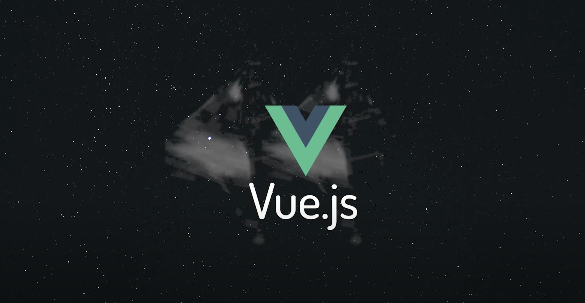

# Was ist ein Framework?
>A **framework** is a library that offers opinions about how software gets built. These opinions allow for predictability and homogeneity in an application; predictability allows software to scale to an enormous size and still be maintainable; predictability and maintainability are essential for the health and longevity of software.

- Grosse JavaScript Library
- Einheitliche Regeln

## Vorteile eines Frameworks
>Every JavaScript framework offers a way to write user interfaces more _declaratively_. That is, they allow you to write code that describes how your UI should look, and the framework makes it happen in the DOM behind the scenes.

- Aufteilung des Codes in Komponenten (SFC)
- Skalierbarkeit & Übersichtlichkeit bei grossen Applikationen
- Deklaratives JavaScript im HTML
- Real-World-Use: In Unternehmen wird meist mit JavaScript Frameworks gearbeitet.

## Ist ein Framework wirklich die richtige Wahl?
> Being an effective web developer means using the most appropriate tools for the job. JavaScript frameworks make front-end application development easy, but they are not a silver bullet that will solve all problems. Bear in mind that you might not need a framework at all — beware that you don't end up using a framework just for the sake of it.

- Lernkurve
- Overengineering
- Abstrahierung
- Community

## Populäre JavaScript-Frameworks
- Vue
- React
- Angular

# Warum Vue.js?
- Flache Lernkurve
- Knackige Dokumentation
- Grosse Community

## Ressourcen
- [Vue Tutorial von MDN](https://developer.mozilla.org/en-US/docs/Learn/Tools_and_testing/Client-side_JavaScript_frameworks/Vue_getting_started)
- [Vue Tutorial von Vue](https://vuejs.org/tutorial/#step-1)
- [Dokumentation](https://vuejs.org/guide/introduction.html)

Zitate aus [MDN über JS-Frameworks](https://developer.mozilla.org/en-US/docs/Learn/Tools_and_testing/Client-side_JavaScript_frameworks/Introduction)

# Navigation
👉 [02 Terminal](02_Terminal.md)

[Zurück zur Übersicht](https://github.com/Witzelfitz/MMA20/tree/main/vuejs)
