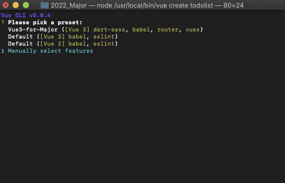
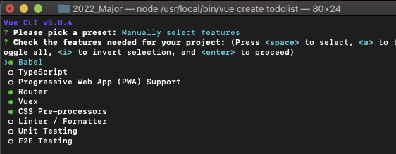
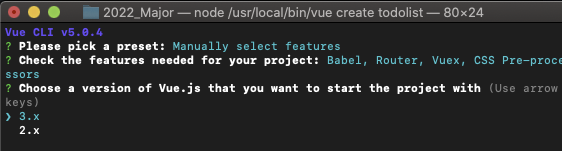
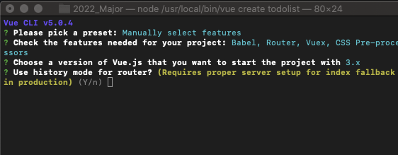
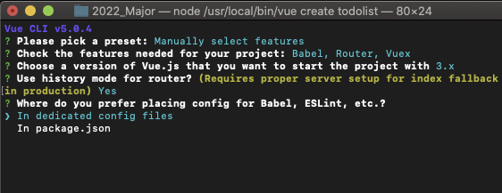
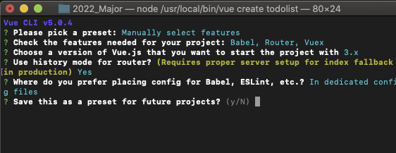
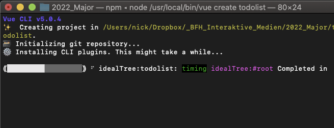
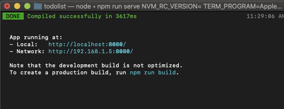

# 04 Unser erstes Vue-Projekt
## Projekt erstellen
1) Öffne das Terminal
2) Navigiere mit dem Befehl `cd` in den Ordner, wo du deinen Projektordner erstellen möchtest.
5) Gib den Befehl `vue create todolist` ein.

4) Wähle `manually select features`



5) Wähle mit Pfeiltasten und `space` folgende Features:
	- Babel
	- Router
	- Vuex

> ⚠️ Achte darauf, dass Linter / Formatter NICHT angewählt ist.

> 🧠 Wähle zusätzlich PWA, wenn du eine PWA erstellen möchtest.

Drücke zum Bestätigen `enter`



6) Wähle mit Pfleitasten und `enter` Version 3



8) Tippe `Y + enter` um fürs Routing den History-Mode auszuwählen



9) Wähle hier `In dedicated config files`



10) Speichere diese Einstellungen als Preset, wenn du willst.



11) Lehne dich zurück und lass es rattern.



12) Navigiere in den Ordner todolist mit `cd todolist`
13) Starte den Projektserver mit  `npm run serve`
14) Dein Projekt läuft nun lokal unter `localhost:8080`




Um den Server wieder zu stoppen, gib 2x `CTRL + C` im Terminal ein:

```
CTRL + C
CTRL + C
```

>🧠 Auch auf Mac muss `CTRL` statt `CMD` verwendet werden.

# Navigation
👉 [05 ToDo-Liste – Vue kennenlernen](05_ToDo.md)

👆 [Zurück zur Übersicht](https://github.com/Witzelfitz/MMA20/tree/main/vuejs)
